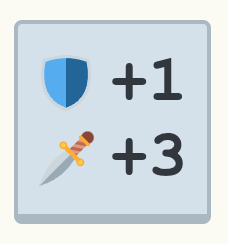

# rogule-stat-display

Display your armor and damage stats in Rogule.

The sword and shield show how much your defense and damage have increased from picked up items.

## Usage

### As a Bookmarklet

1. Go to https://caiorss.github.io/bookmarklet-maker/.
1. Copy/paste the contents of [index.js](./index.js) into the first textarea and click on the "Generate Bookmarklet" button.
1. Drag the blue "bookmarklet" button onto your bookmark bar.
1. Go to https://rogule.com/ and click on the "Play it now" button.
1. Click on the bookmarklet.

### As a script

1. Go to https://rogule.com/ and click on the "Play it now" button.
1. Open the browser's console.
1. Copy/paste the contents of [index.js](./index.js) into the console .and press enter.
